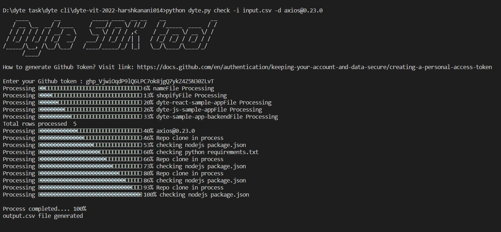
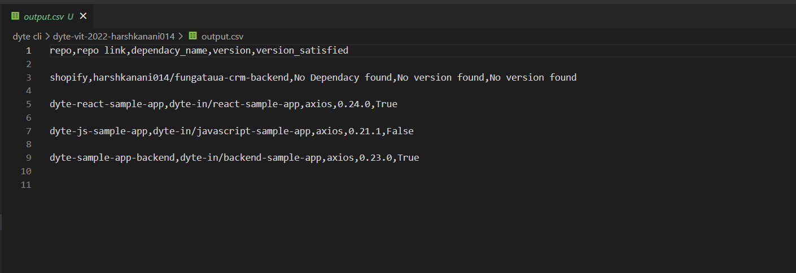
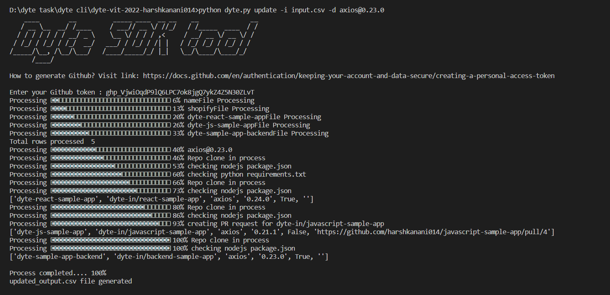
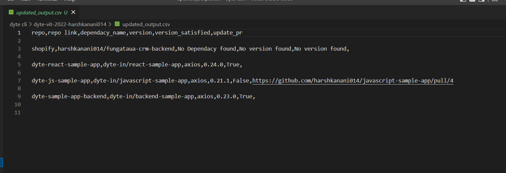

[](https://classroom.github.com/online_ide?assignment_repo_id=7950718&assignment_repo_type=AssignmentRepo)
<div id="top"></div>
<!--
*** Thanks for checking out the Best-README-Template. If you have a suggestion
*** that would make this better, please fork the repo and create a pull request
*** or simply open an issue with the tag "enhancement".
*** Don't forget to give the project a star!
*** Thanks again! Now go create something AMAZING! :D
-->


<!-- PROJECT SHIELDS -->
<!--
*** I'm using markdown "reference style" links for readability.
*** Reference links are enclosed in brackets [ ] instead of parentheses ( ).
*** See the bottom of this document for the declaration of the reference variables
*** for contributors-url, forks-url, etc. This is an optional, concise syntax you may use.
*** https://www.markdownguide.org/basic-syntax/#reference-style-links
-->

[![LinkedIn][linkedin-shield]][linkedin-url]


<!-- PROJECT LOGO -->
<br />
<div align="center">
  <a href="https://github.com/dyte-submissions/dyte-vit-2022-harshkanani014/">
    
  </a>

<h3 align="center">Dyte Dependency checker Tool</h3>

  <p align="center">
    project_description
    <br />
    <a href="https://github.com/dyte-submissions/dyte-vit-2022-harshkanani014"><strong>Explore the docs »</strong></a>
    <br />
    <br />
    <a href="https://github.com/dyte-submissions/dyte-vit-2022-harshkanani014">View Demo</a>
    ·
    <a href="https://github.com/dyte-submissions/dyte-vit-2022-harshkanani014/issues">Report Bug</a>
    ·
    <a href="https://github.com/dyte-submissions/dyte-vit-2022-harshkanani014/issues">Request Feature</a>
  </p>
</div>


<!-- TABLE OF CONTENTS -->
<details>
  <summary>Table of Contents</summary>
  <ol>
    <li>
      <a href="#about-the-project">About The Project</a>
      <ul>
        <li><a href="#built-with">Built With</a></li>
      </ul>
    </li>
    <li>
      <a href="#getting-started">Getting Started</a>
      <ul>
        <li><a href="#prerequisites">Prerequisites</a></li>
        <li><a href="#installation">Installation</a></li>
      </ul>
    </li>
    <li><a href="#usage">Usage</a></li>
    <li><a href="#roadmap">Roadmap</a></li>
    <li><a href="#contributing">Contributing</a></li>
    <li><a href="#license">License</a></li>
    <li><a href="#contact">Contact</a></li>
    <li><a href="#acknowledgments">Acknowledgments</a></li>
  </ol>
</details>


<!-- ABOUT THE PROJECT -->
## About The Project

#### Published Package on Pypi : [https://pypi.org/project/Dyte-Dependency-version-checker/](https://pypi.org/project/Dyte-Dependency-version-checker/)


[![Product Name Screen Shot][product-screenshot]](https://example.com)

Dyte SDK Tool is Command Line Interface (CLI) Tool to check version of dependency present in repositories file uploaded by user.
Dyte CLI tool provides the following features:

1. Check satisfied version and return output.csv with all satisfied versions. 
2. Also creates Pull request to update particular version of multiple dependencies in single command. 
3. Easy to use CLI tool with clean and clear output.
4. Create PR request for updating dependencies.
5. Support package.json (NodeJS) and requirements.txt (Python).

<p align="right">(<a href="#top">back to top</a>)</p>

### Extra Features
#### 1. Published package on Pypi so anyone can use using Pypi [Dyte Dependency version checker](https://pypi.org/project/Dyte-Dependency-version-checker/)
#### 2. supports NodeJs and Python Both
#### 3. Can check muliple dependencies with single command on both Python and NodeJS Dependency file
#### 4. Proper format of csv along with all information
#### 5. Can also check and update Pull request for Python libraries as well
#### 6. Re-usable code so can add more language support in future
#### 7. Styling in CLI

### Built With

* [Python](https://www.python.org/)

### Libraries used

* [Git]()
* [pyinstaller]()
* [click]()
* [progress]()
* [pyfiglet]()

<p align="right">(<a href="#top">back to top</a>)</p>


<!-- GETTING STARTED -->
## Getting Started

This is an example of how you may give instructions on setting up your project locally.
To get a local copy up and running follow these simple example steps.

### Prerequisites

This is an example of how to list things you need to use the software and how to install them.
* python [https://www.python.org/downloads/]
* pip
  ```sh
  python3 -m pip install --upgrade pip
  ```

### Installation of code from package published on Pypi (Easy to download and use)

1. Create and Activate virtual environment 
    ```sh
    py -m venv <env-name>
    ```
  
    ```sh
    <env-name>\Scripts\activate.bat
    ```

2. Install Package from Pypi
   ```sh
   pip install Dyte-Dependency-version-checker
   ```
   [Note : Skip installation from Direct repo if you already installed our package from Pypi]

### Usage

3. Help command 
    ```sh
    dyte --help
    ```
4. Use below command to enter csv file and check dependency version
    ```sh
    dyte check -i <file-name>.csv -d <dependency-name>
    ```
   
    We can also give multiple dependency to check. for example
    ```sh
    dyte check -i <file-name>.csv -d <dependency-name> -d <dependency-name> -d <dependency-name>
    ```
   
    ```
    -i = input-file
    -d = depedency-name
    ```

5. Use below command to enter csv file and update PULL request based on version of dependency
    ```sh
    dyte update -i <file-name>.csv -d <dependency-name>
    ```
   
    We can also give multiple dependency to check. for example
    ```sh
    dyte update -i <file-name>.csv -d <dependency-name> -d <dependency-name> -d <dependency-name>
    ```
   
    ```
    update = to create PR if version is not satisfied 
    -i = input-file
    -d = depedency-name
    ```


### Install Directly from Github repo

1. Create and Activate virtual environment 
    ```sh
    py -m venv <env-name>
    ```
    
    ```sh
    <env-name>\Scripts\activate.bat
    ```

2. Clone the repo
    ```sh
    git clone https://github.com/dyte-submissions/dyte-vit-2022-harshkanani014
    ```

3. Install python libraries from requirements.txt
    ```sh
    pip install -r requirements.txt
    ```

### Usage
  
4. Use bellow to enter csv file and check dependency version
    ```sh
    python dyte.py check -i <file-name>.csv -d <dependency-name>
    ```
   
    We can also give multiple dependency to check for example
    ```sh
    python dyte.py check -i <file-name>.csv -d <dependency-name> -d <dependency-name> -d <dependency-name>
    ```
   
    ```
    -i = input-file
    -d = depedency-name
    ```

5. Use bellow to enter csv file and update PULL request based on version of dependency
    ```sh
    python dyte.py update -i <file-name>.csv -d <dependency-name>
    ```
   
    We can also give multiple dependency to check for example
    ```sh
    python dyte.py update -i <file-name>.csv -d <dependency-name> -d <dependency-name> -d <dependency-name>
    ```
   
    ```
    update = to create PR if version is not satisfied 
    -i = input-file
    -d = depedency-name
    ```

<p align="right">(<a href="#top">back to top</a>)</p>


<!-- USAGE EXAMPLES -->
## Usage with output

### Exceuting command : dyte check -i input.csv -d axios@0.23.0



### OUTPUT 



### Exceuting command : dyte update -i input.csv -d axios@0.23.0



### OUTPUT 




<p align="right">(<a href="#top">back to top</a>)</p>


See the [open issues](https://github.com/dyte-submissions/dyte-vit-2022-harshkanani014/issues) for a full list of proposed features (and known issues).

<p align="right">(<a href="#top">back to top</a>)</p>


<!-- CONTRIBUTING -->
## Contributing

Contributions are what make the open source community such an amazing place to learn, inspire, and create. Any contributions you make are **greatly appreciated**.

If you have a suggestion that would make this better, please fork the repo and create a pull request. You can also simply open an issue with the tag "enhancement".
Don't forget to give the project a star! Thanks again!

1. Fork the Project
2. Create your Feature Branch (`git checkout -b feature/AmazingFeature`)
3. Commit your Changes (`git commit -m 'Add some AmazingFeature'`)
4. Push to the Branch (`git push origin feature/AmazingFeature`)
5. Open a Pull Request

<p align="right">(<a href="#top">back to top</a>)</p>


<!-- LICENSE -->
## License

Distributed under the MIT License. See `LICENSE.txt` for more information.

<p align="right">(<a href="#top">back to top</a>)</p>


<!-- CONTACT -->
## Contact

Your Name - Harsh Kanani (19BCE2562)- harshkanani100@gmail.com

Project Link: [https://github.com/dyte-submissions/dyte-vit-2022-harshkanani014](https://github.com/dyte-submissions/dyte-vit-2022-harshkanani014)

<p align="right">(<a href="#top">back to top</a>)</p>


<p align="right">(<a href="#top">back to top</a>)</p>


<!-- MARKDOWN LINKS & IMAGES -->
<!-- https://www.markdownguide.org/basic-syntax/#reference-style-links -->
[contributors-shield]: https://img.shields.io/github/contributors/github_username/repo_name.svg?style=for-the-badge
[contributors-url]: https://github.com/github_username/repo_name/graphs/contributors
[forks-shield]: https://img.shields.io/github/forks/github_username/repo_name.svg?style=for-the-badge
[forks-url]: https://github.com/github_username/repo_name/network/members
[stars-shield]: https://img.shields.io/github/stars/github_username/repo_name.svg?style=for-the-badge
[stars-url]: https://github.com/github_username/repo_name/stargazers
[issues-shield]: https://img.shields.io/github/issues/github_username/repo_name.svg?style=for-the-badge
[issues-url]: https://github.com/github_username/repo_name/issues
[license-shield]: https://img.shields.io/github/license/github_username/repo_name.svg?style=for-the-badge
[license-url]: https://github.com/github_username/repo_name/blob/master/LICENSE.txt
[linkedin-shield]: https://img.shields.io/badge/-LinkedIn-black.svg?style=for-the-badge&logo=linkedin&colorB=555
[linkedin-url]: https://www.linkedin.com/in/harsh-kanani-69a45818b/
[product-screenshot]: images/screenshot.png
